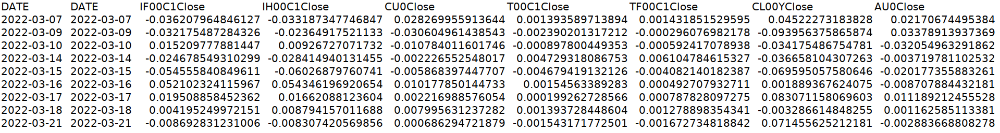

# tsTransformer

To process my dataset, I cannot find a good transformer models suitable as there are many deep learning models already. So I am trying to create one my own.

# Folders Instructions

- /assa # folder to include tools for dataset reading, preprocessing, time features extractions and etc.\
- /model # folder for the transformer model that I am going to create.\
- /data # folder to put on mydataset and temporarily generated data processing outputs.

My dataset is not necessarily put in the data folder as, in fact, I am using the dataset generated by my other projects.

# My Dataset
### Discriptions
I generate my dataset of four parts:
- Part I: trading data. (including commodity trading data, yields of 10 year treasuries, currencies, etc.)
- Part II: sentiment analysis of public resourced news.
- Part III: sentiment analysis of social media like weibo.
- part IV: time features generated from the data obtaining date.

In the beginning, I've already started to generate log return for trading data. Although the current project is inspired 
by "informer, cookieminions" who actually performed the model into the raw sequence of the trading data, I am thinking
of the potential outcome from log return rather than the raw sequence.

### Examples

# Early Efforts Been Made
During 2016 to 2022, my early efforts are made to analysis the trading data, its relationships with macro data as well 
as sentiments deriving from weibo and email lists which contains resources from world's famous media like bloomberg and 
reuters. 

Models so far I used includes Hodrick Prescott Filter rather than moving average, and using the trend and cycle data for
predictions. Machine learning models are also learned but I found them too easy to have homogenesis results and that
were not good for predictions. Thus models like decision trees or random forests were less considered previously. 

The dataset was differentiated and log transformed, ensemble and stacking technics were also used to combine the results
generated from different models as well as different time frame. Inspired by natural language processing models, I'm even
embedding the dataset into discrete data point sequence and then fitted into NLP deep learning models. Using these extra
prediction data, I could test and side proof whether the predictions could be accepted or rejected.

While the early efforts do not present here in this repo, I am very keen to share with others my idea.

# Failed Attempt
### Training online
I've tried baidu AI and AWS during May 2023, but found it pretty much disappointing. While baidu AI is simple but just
simply not working, AWS was too complicated and required a huge amount of work to do out sourcing not only one man can 
achieve. I am thinking that, perhaps I can only stop at where the books published can go so far as the most effective 
tutorial material enough to make progress for me are all from the books. Ever since the ChatGPT, I found it actually 
become more difficult than before to get free resources from the internet, specially the programming. 

# New Attempt
## With the help of books
I've come up with some new ideas, using machine learning on time series analysis and predictions. With the help of books
, I finally am having a sight into the transformer architecture starting with encoder-decoder algorithms. And the 
dataset is also needed to reengineer for having more features.

The idea of mega model.
Coming into the new era of mega model with millions of parameters, the idea is to have one mode for multiple tasks. That
also is the benefit of Global Forecasting Model rather than smaller dataset ones. Even with in the particular task, all
different targets and their features should also be combined into one single dataset for training the model.

### New engineering of the monthly macro time series data.
Why starting using monthly macro data as it contains smaller size of data? It is because the processing of the dataset 
to generate time features will be easier as the monthly dataset contains only year and day timestamps and fewer steps.

### Steps of feature engineering

- Time delay embadding
- Exponentially weighted moving averages
- Temporal embedding

### Steps of target transformatins

## Selecting the models.
Well, since there are pytorch lightning and pytorch forecast, it is much easier to initiate some famous models including
N-BEATS, Informer and Autoinformer.

Please refer to /scripts/trySometransformers.py for the first try.

 